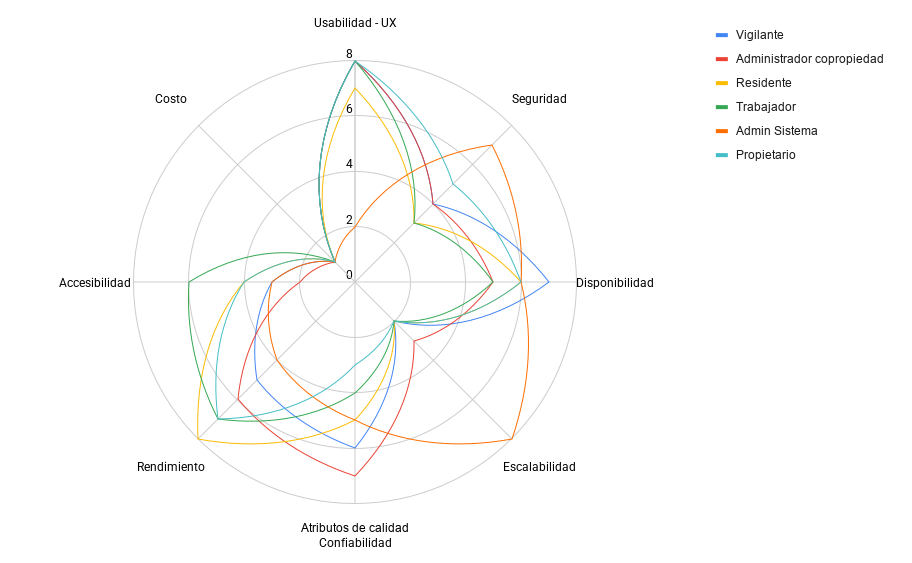

# Documento de Arquitectura de Software (DAS)

## Proyecto

**Nombre del proyecto:** My_Complex

## Arquitectos

- John Esteban Roldán Marín
- Jaider Sebastián Lucuara Cortés

---

# Descripción del proyecto

My_Complex es un Software as a Service (SaaS) enfocado en la gestión de datos y automatización de tareas propias de administraciones de vivienda horizontal.

## Propósito

 Lo que se busca con este proyecto es facilitar los "procso cotidianos", hacerlos seguros, eficientes y transparentes.

## Contexto

La necesidad de este proyecto surge de buscar una solución a una problemática común: Muchas unidades residenciales todavía manejan registro de visitantes en cuadernos físicos, comunicaciones entre vigilante y residentes de una manera muy poco formal y reservas anotadas en papel (procesos cotidianos). 
Por lo anterior, se pueden generar riesgos de seguridad,falta de transparencia en los datos, pérdida de información, entre otros. Gracias a esto, notamos una oportunidad de desarrollo de un sistema en el cual se pueda manejar de mejor manera estos problemas mencionados 

## Alcance

#### Sí
- Control digital de visitantes
- Notificaciones push (comunicación continua entre los miembros de la comunidad)
- Reservas de zonas comunes
- JWT y roles de usuario (administrador, residente, vigilante, propietario, trabajador)
- Dashboard de tareas para trabajadores
- Publicación de noticias de interés para la comunidad
- Creación de reuniones (Software externo)

#### No
- Integración con hardware físico complejo (biometría avanzada)
- Automatización IoT completa del conjunto
- Sistema contable completo empresarial
- Gestión legal de contratos inmobiliarios
- Pasarelas de pago

---

# Drivers arquitectónicos

## Atributos de calidad

| Atributo de calidad | Característica | Descripción | Justificación |
| --- | --- | --- | --- |
| Usabilidad - UX | Facilidad de uso para múltiples actores | El sistema debe ser intuitivo para todos los perfiles de usuario, siendo evaluado como el atributo de mayor prioridad global en el mapa de empatía. | El propósito central es facilitar procesos cotidianos (registro de visitantes, reservas, comunicación) para usuarios con diferentes necesidades, como vigilantes, residentes y administradores. |
| Seguridad | Control de acceso y protección de información | Se deben implementar controles de autenticación mediante JWT, roles de usuario y lineamientos de desarrollo seguro basados en OWASP Top 10. | El sistema manejará datos sensibles protegidos por la Ley 1581 de 2012, por lo que es vital evitar vulnerabilidades, exposición de información y accesos no autorizados a las funciones de cada rol. |
| Escalabilidad | Crecimiento sin reconstrucción del sistema | La arquitectura debe soportar el crecimiento progresivo del número de operaciones, usuarios y unidades residenciales. | El proyecto no se limita a una sola unidad residencial, sino que tiene una proyección de expansión hacia múltiples conjuntos, requiriendo que la solución evolucione con la carga. |

## Funcionalidades significativas

| Historia de Usuario| Especificación| Tipo de funcionalidad significativa | Justificación | Observación |
| :--- | :--- | :--- | :--- | :--- |
| HU-02 | Inicio de sesión | Valor de negocio | Es la puerta de entrada transversal al sistema; condiciona autenticación, sesiones, disponibilidad y acceso seguro a las demás funcionalidades. | Debe garantizarse que el acceso sea independiente de las funcionalidades específicas del usuario y que las credenciales no sean expuestas. Además, cualquier mecanismo de autenticación debe permitir posteriormente aplicar correctamente las restricciones definidas por los roles. |
| HU-03 | Gestión de roles | Valor de negocio | Define qué puede consultar y modificar cada rol; debe aplicarse de forma consistente en interfaz, backend y API para proteger todas las operaciones. | Su implementación debe mantenerse alineada con las funcionalidades disponibles para cada tipo de usuario, evitando que las restricciones se apliquen únicamente en la interfaz. La autorización debe validarse también en las operaciones que modifican o consultan información. |
| HU-10 | Publicar noticiass | Valor de negocio | Es el canal oficial para comunicar información relevante a los residentes; exige contenido correcto, publicación oportuna y acceso restringido a administradores autorizados. | La publicación debe estar restringida a los usuarios autorizados, mientras que la consulta debe estar disponible para los usuarios a quienes esté dirigida la información. También debe conservarse la información básica de la publicación para garantizar su trazabilidad. |
| HU-14 | Notificaciones del sistema | Reto técnico | lo ponemos como reto tecnico ya que debido a se que debe definir cómo realizar la entrega de notificaciones fuera de la sesión activa. Se debe determinar cómo implementar notificaciones push en navegadores, cómo gestionar los permisos y suscripciones de cada usuario y qué comportamiento tendrá el sistema cuando el usuario cierre sesión, cierre el navegador o pierda la conexión a Internet. | tambien tendriamos que mirar como garantizar que los eventos importantes no se pierdan durante una desconexión y establecer cómo se almacenarán y entregarán posteriormente las notificaciones pendientes cuando el usuario vuelva a estar disponible. |
| HU-06 | Autorizar visitante | Valor de negocio | Aporta valor directo al control de acceso de la unidad residencial y a la seguridad de los residentes. Técnicamente requiere mantener estados consistentes durante el proceso de autorización y evitar operaciones incorrectas ante interrupciones o solicitudes repetidas. | La autorización debe estar asociada al usuario que la realiza y al visitante correspondiente, manteniendo un estado claro de la autorización. Los cambios deben quedar registrados para evitar inconsistencias entre la autorización realizada y el ingreso efectivo del visitante. |
| HU-17 | Panel administrativo | Valor de negocio | Esta funcionalidad es significativa porque centraliza la gestión de las operaciones administrativas de la unidad residencial, permitiendo al personal autorizado (osea un administrador) gestionar desde un mismo espacio aspectos como usuarios, noticias, tareas y demás procesos administrativos. Esto reduce la dispersión de la información y facilita el seguimiento de las actividades de la administración. tambien, al ser un punto central de gestión, su correcto funcionamiento es importante para mantener la continuidad y control de las operaciones administrativas del sistema. | Debemos garantizar que cada administrador solo pueda acceder a las funciones que le correspondan y que las acciones realizadas queden asociadas al usuario que las ejecutó. tambien, para el correcto funcioanamiento del sistema la información mostrada debe mantenerse actualizada para evitar que la administración tome decisiones con datos desactualizados o inconsistentes. |
## Restricciones técnicas

| Tipo | Categoría | Restricción técnica | Justificación |
| --- | --- | --- | --- |
| Propia del proyecto | Prácticas de diseño | El diseño del sistema deberá aplicar principios como SOLID, GRASP y separación de responsabilidades, buscando mantener componentes con responsabilidades claramente definidas. | El sistema está planteado para crecer tanto en funcionalidades como en usuarios y unidades residenciales. Mantener responsabilidades separadas facilita incorporar cambios y nuevas funcionalidades sin generar dependencias innecesarias entre diferentes partes del sistema. |
| Propia del proyecto | Prácticas DevOps | Las nuevas versiones deberán pasar por un proceso controlado de integración, validación y despliegue antes de ponerse a disposición de los usuarios. | Debido a que el sistema continuará creciendo, una modificación puede afectar funcionalidades existentes. Validar los cambios antes del despliegue permite detectar errores y reducir el riesgo de afectar la operación del sistema. |
| Propia del proyecto | Prácticas de desarrollo seguro | Las funcionalidades deberán implementar controles de autenticación, autorización y gestión de permisos, aplicando prácticas de desarrollo seguro y lineamientos de OWASP Top 10, especialmente en las funcionalidades relacionadas con control de acceso, fallos de autenticación, protección de información sensible, inyección y configuraciones inseguras. | El sistema manejará información personal y operaciones diferenciadas según el rol del usuario. Por esta razón, es necesario garantizar que cada usuario pueda acceder únicamente a las funcionalidades y datos que le corresponden, evitando accesos o modificaciones no autorizadas. Además, los formularios, consultas y operaciones del sistema deberán protegerse frente a entradas maliciosas y vulnerabilidades de seguridad. La referencia a OWASP permite establecer controles frente a riesgos directamente relacionados con el sistema, como Broken Access Control, Identification and Authentication Failures, Cryptographic Failures e Injection, reduciendo la posibilidad de exposición de información, suplantación de usuarios y acceso indebido a las funcionalidades administrativas. |
| Propia del proyecto | Escalabilidad | La solución deberá permitir el crecimiento progresivo del número de usuarios, unidades residenciales y operaciones, sin requerir una reconstrucción completa del sistema. | El sistema no está pensado únicamente para una unidad residencial. La proyección incluye múltiples conjuntos y un crecimiento significativo de usuarios, por lo que la solución debe poder evolucionar sin que el aumento de carga obligue a reconstruir el sistema. |

## Restricciones de negocio

| Tipo | Restricción de negocio | Justificación | Plan de acción |
| --- | --- | --- | --- |
| Humano | Disponibilidad limitada de los integrantes del equipo y de los usuarios para las actividades de validación del proyecto. | El proyecto es desarrollado por un equipo reducido y, adicionalmente, la validación de las funcionalidades requiere la participación de personas que representen los diferentes perfiles del sistema, como administradores, residentes y personal encargado del control de visitantes. La disponibilidad limitada de estas personas puede retrasar la definición, validación y corrección de los requerimientos. | Establecer un cronograma de trabajo y validaciones, priorizando las reuniones y pruebas de las funcionalidades críticas. Las validaciones se realizarán de manera incremental para detectar errores o cambios necesarios sin esperar hasta el final del proyecto. |
| Tiempo | Necesidad de reducir el tiempo requerido para disponer de funcionalidades de valor para las unidades residenciales. | Aunque MyComplex se desarrollará durante varios semestres, existe un costo de oportunidad asociado a retrasar la disponibilidad de funcionalidades relevantes para los usuarios. Una entrega tardía puede impedir validar tempranamente la solución, retrasar la obtención de retroalimentación y postergar la generación de valor para las unidades residenciales. | Priorizar las funcionalidades de mayor valor para el negocio y realizar entregas incrementales. Cada etapa deberá proporcionar funcionalidades que puedan ser utilizadas o validadas, permitiendo obtener retroalimentación temprana y ajustar las siguientes entregas. |
| Legal | Cumplimiento de la Ley 1581 de 2012 sobre protección de datos personales. | MyComplex gestionará información personal de residentes, visitantes, administradores y demás usuarios. Por esta razón, el tratamiento de estos datos debe realizarse conforme a la normativa colombiana de protección de datos personales. El cumplimiento de esta normativa condiciona la forma en que MyComplex puede recolectar, almacenar, consultar y tratar la información personal, por lo que debe ser considerado desde las etapas iniciales del proyecto para evitar modificaciones posteriores o riesgos legales que afecten su continuidad. | Definir el tratamiento de los datos personales desde el desarrollo del sistema, aplicar controles de acceso de acuerdo con los roles, limitar la consulta de información a usuarios autorizados y establecer mecanismos adecuados para proteger los datos almacenados y transmitidos. |
| Presupuesto | Los recursos económicos disponibles deben ser suficientes para garantizar la viabilidad y sostenibilidad del sistema durante su evolución y crecimiento. | Las decisiones de inversión no pueden basarse únicamente en seleccionar la alternativa de menor costo, ya que una solución económica puede presentar limitaciones de capacidad, disponibilidad, soporte, mantenimiento o crecimiento que posteriormente generen mayores costos para el proyecto. Además, MyComplex está planteado para poder crecer y ser utilizado por múltiples unidades residenciales, por lo que los costos de infraestructura y operación pueden aumentar a medida que crezca el número de usuarios. | Evaluar las alternativas tecnológicas considerando el costo total de la solución, incluyendo infraestructura, operación, mantenimiento, soporte y crecimiento. Se priorizarán alternativas que representen una relación adecuada entre costo, capacidad y valor aportado, evitando que una decisión de bajo costo comprometa la viabilidad y evolución futura del proyecto. |
| Proceso | Cambios y evolución de los requerimientos a medida que se validan las necesidades reales de las unidades residenciales. | Durante el desarrollo pueden identificarse nuevas necesidades, cambios en los procesos administrativos o ajustes solicitados por los usuarios. Si estos cambios se incorporan sin control, pueden aumentar el alcance, generar retrabajo y afectar tanto el tiempo como los recursos disponibles para el proyecto. | Mantener un backlog actualizado, analizar el impacto de cada cambio antes de aprobarlo y priorizar las modificaciones según su valor para el negocio. Los cambios que comprometan significativamente el alcance, tiempo o recursos deberán ser evaluados antes de incorporarse al proyecto. |

---

# QAW (Quality Attribute Workshop)

**Objetivo del taller:**

> Hacer explícito lo implícito: Nada puede quedar ambiguo, todo debe ser medible, trazable, claro y concreto

## Trade-off

La siguiente matriz presenta el orden de prioridad de los atributos de calidad. Ocho representa la prioridad más alta y uno la más baja.

| Atributo de calidad | 8 | 7 | 6 | 5 | 4 | 3 | 2 | 1 |
| --- | :---: | :---: | :---: | :---: | :---: | :---: | :---: | :---: |
| Usabilidad - UX | X |  |  |  |  |  |  |  |
| Seguridad |  | X |  |  |  |  |  |  |
| Disponibilidad |  |  | X |  |  |  |  |  |
| Escalabilidad |  |  |  | X |  |  |  |  |
| Confiabilidad |  |  |  |  | X |  |  |  |
| Rendimiento |  |  |  |  |  | X |  |  |
| Accesibilidad |  |  |  |  |  |  | X |  |
| Costo |  |  |  |  |  |  |  | X |

## Mapa de empatía
Se realizó una valoración de los atributos de calidad más importantes para cada actor del software.
| Atributo de calidad | Vigilante | Administrador de copropiedad | Residente | Trabajador | Propietario | Total | Ponderado global |
| --- | ---: | ---: | ---: | ---: | ---: | ---: | ---: |
| Usabilidad - UX | 8 | 8 | 7 | 8 | 8 | 39 | 21.67% |
| Seguridad | 4 | 4 | 3 | 3 | 5 | 19 | 10.56% |
| Disponibilidad | 7 | 5 | 6 | 5 | 6 | 29 | 16.11% |
| Escalabilidad | 2 | 3 | 2 | 2 | 2 | 11 | 6.11% |
| Confiabilidad | 6 | 7 | 5 | 4 | 3 | 25 | 13.89% |
| Rendimiento | 5 | 6 | 8 | 7 | 7 | 33 | 18.33% |
| Accesibilidad | 3 | 2 | 4 | 6 | 4 | 19 | 10.56% |
| Costo | 1 | 1 | 1 | 1 | 1 | 5 | 2.78% |
| **Total** | **36** | **36** | **36** | **36** | **36** | **180** | **100.00%** |

### Hallazgos relevantes

Gracias al mapa de empatía logramos definir cuáles son los usuarios que más ideas nos aportarán las ideas para formular unos escenarios de calidad bien madurados.

## Escenarios de calidad

# Quality Attribute Scenario: 01 - Integridad de datos ante fallas del sistema

## Metadata

- **Quality Attribute:** Confiabilidad
- **Priority:** Alta
- **Difficulty / Risk:** Media
- **Status:** Aprobado

## Scenario Definition

| Part | Component | Description |
| :--- | :--- | :--- |
| **1** | **Source** | Falla del servidor o de la red |
| **2** | **Stimulus** | **Interrumpir** una operación mientras se guarda información. |
| **3** | **Artifact** | Base de datos |
| **4** | **Environment** | El sistema opera de forma normal durante el registro o actualización de información. |
| **5** | **Response** | El sistema revierte la operación y conserva la última información válida. |
| **6** | **Response Measure** | 100% de las operaciones interrumpidas deben conservar la información anterior sin datos incompletos o duplicados. |

## Architecture Notes

- **Business Rationale:** Evita que una falla durante una operación genere información incorrecta o inconsistente en el sistema.

- **Architectural Tactics:** Transacciones y reversión de operaciones ante fallas.

- **Assumptions & Risks:** Se asume que las operaciones críticas pueden ejecutarse mediante transacciones. Una falla física de la base de datos puede impedir la recuperación de la información.

---

# Quality Attribute Scenario: 02 - Optimización del costo de infraestructura

## Metadata

- **Quality Attribute:** Costo
- **Priority:** Alta
- **Difficulty / Risk:** Media
- **Status:** Aprobado

## Scenario Definition

| Part | Component | Description |
| :--- | :--- | :--- |
| **1** | **Source** | Administrador |
| **2** | **Stimulus** | **Asignar** recursos de infraestructura según la demanda de los servicios. |
| **3** | **Artifact** | Infraestructura |
| **4** | **Environment** | El sistema se encuentra en proceso de despliegue y crecimiento. |
| **5** | **Response** | El sistema permite ajustar los recursos utilizados según la demanda. |
| **6** | **Response Measure** | Los recursos utilizados deben corresponder a la demanda registrada durante cada periodo de evaluación. |

## Architecture Notes

- **Business Rationale:** Evita pagar por recursos de infraestructura que no están siendo utilizados.

- **Architectural Tactics:** Escalamiento de recursos y monitoreo del consumo.

- **Assumptions & Risks:** Se requiere medir el consumo de los recursos para determinar cuándo aumentar o disminuir su capacidad.

---

# Quality Attribute Scenario: 03 - Operación de portería sin conexión

## Metadata

- **Quality Attribute:** Disponibilidad
- **Priority:** Alta
- **Difficulty / Risk:** Media
- **Status:** Aprobado

## Scenario Definition

| Part | Component | Description |
| :--- | :--- | :--- |
| **1** | **Source** | Falla de conexión a Internet |
| **2** | **Stimulus** | **Perder** la conexión a Internet mientras se registra un visitante. |
| **3** | **Artifact** | Sistema de portería |
| **4** | **Environment** | El sistema opera normalmente durante el registro de visitantes. |
| **5** | **Response** | El sistema permite registrar al visitante y sincroniza la información cuando se restablece la conexión. |
| **6** | **Response Measure** | 0 registros perdidos y sincronización completada en un máximo de 10 segundos después de restablecer la conexión. |

## Architecture Notes

- **Business Rationale:** Permite mantener el registro de visitantes aunque exista una interrupción temporal de Internet.

- **Architectural Tactics:** Almacenamiento local temporal y sincronización automática.

- **Assumptions & Risks:** Se asume que el dispositivo de portería dispone de almacenamiento local. Una falla del dispositivo antes de sincronizar puede provocar pérdida de registros.

---

# Quality Attribute Scenario: 04 - Incorporación de nuevos conjuntos residenciales

## Metadata

- **Quality Attribute:** Escalabilidad
- **Priority:** Alta
- **Difficulty / Risk:** Media
- **Status:** Aprobado

## Scenario Definition

| Part | Component | Description |
| :--- | :--- | :--- |
| **1** | **Source** | Administrador |
| **2** | **Stimulus** | **Incorporar** nuevos conjuntos residenciales al sistema. |
| **3** | **Artifact** | Base de datos |
| **4** | **Environment** | El sistema aumenta el número de conjuntos administrados. |
| **5** | **Response** | El sistema registra los nuevos conjuntos sin afectar la información existente. |
| **6** | **Response Measure** | 100% de la información de los conjuntos existentes debe conservarse correctamente después de incorporar nuevos conjuntos. |

## Architecture Notes

- **Business Rationale:** Permite que MyComplex crezca sin afectar la información de los conjuntos que ya utilizan el sistema.

- **Architectural Tactics:** Separación lógica de la información por conjunto y asociación de los registros con su conjunto correspondiente.

- **Assumptions & Risks:** Se asume que cada registro del sistema puede asociarse a un conjunto residencial. Un crecimiento elevado puede requerir optimización adicional de la base de datos.

---

# Quality Attribute Scenario: 05 - Manejo de alta concurrencia

## Metadata

- **Quality Attribute:** Escalabilidad
- **Priority:** Alta
- **Difficulty / Risk:** Alta
- **Status:** Draft

## Scenario Definition

| Part | Component | Description |
| :--- | :--- | :--- |
| **1** | **Source** | Residente |
| **2** | **Stimulus** | **Ejecutar** cualquier funcionalidad del sistema. |
| **3** | **Artifact** | Sistema |
| **4** | **Environment** | 1000 usuarios están conectados al mismo tiempo y el sistema opera de forma normal. |
| **5** | **Response** | El sistema procesa la petición de forma exitosa. |
| **6** | **Response Measure** | El sistema responde correctamente a la petición deseada por el usuario de acuerdo con los resultados esperados por él. |

## Architecture Notes

- **Business Rationale:** Evita la frustración de los residentes durante momentos críticos de comunicación en la comunidad.

- **Architectural Tactics:** Implementación de Load Balancer y caché de lectura.

- **Assumptions & Risks:** Se asume una cantidad de 1000 usuarios porque se desconoce cuántos usuarios utilizarán el sistema simultáneamente y a partir de qué cantidad podrían generarse cuellos de botella.

---

# Quality Attribute Scenario: 06 - Diseño responsivo y adaptabilidad móvil

## Metadata

- **Quality Attribute:** Accesibilidad
- **Priority:** Media
- **Difficulty / Risk:** Media
- **Status:** Aprobado

## Scenario Definition

| Part | Component | Description |
| :--- | :--- | :--- |
| **1** | **Source** | Trabajador |
| **2** | **Stimulus** | **Acceder** al sistema desde un dispositivo móvil. |
| **3** | **Artifact** | Interfaz |
| **4** | **Environment** | El sistema se utiliza desde dispositivos con diferentes tamaños de pantalla. |
| **5** | **Response** | El sistema adapta la interfaz al tamaño de la pantalla. |
| **6** | **Response Measure** | 100% de las funciones principales deben poder utilizarse sin desplazamiento horizontal ni zoom obligatorio. |

## Architecture Notes

- **Business Rationale:** Permite utilizar las funciones principales desde diferentes dispositivos sin limitar el acceso por el tamaño de la pantalla.

- **Architectural Tactics:** Diseño responsive y distribución flexible de los elementos de la interfaz.

- **Assumptions & Risks:** Se deben definir los dispositivos y tamaños de pantalla que serán soportados.

---

# Quality Attribute Scenario: 07 - Facilidad de aprendizaje del sistema

## Metadata

- **Quality Attribute:** Usabilidad
- **Priority:** Media
- **Difficulty / Risk:** Media
- **Status:** Aprobado

## Scenario Definition

| Part | Component | Description |
| :--- | :--- | :--- |
| **1** | **Source** | Trabajador |
| **2** | **Stimulus** | **Intentar** registrar una actividad por primera vez. |
| **3** | **Artifact** | Interfaz |
| **4** | **Environment** | El trabajador utiliza el sistema por primera vez sin asistencia directa. |
| **5** | **Response** | El sistema proporciona las indicaciones necesarias para completar la actividad. |
| **6** | **Response Measure** | Al menos el 80% de los usuarios debe completar correctamente la actividad en su primer intento. |

## Architecture Notes

- **Business Rationale:** Reduce el tiempo de aprendizaje y la necesidad de asistencia durante el uso inicial del sistema.

- **Architectural Tactics:** Navegación consistente, formularios simples y mensajes de orientación.

- **Assumptions & Risks:** La actividad utilizada para evaluar el primer intento debe estar definida previamente.

---

# Quality Attribute Scenario: 08 - Control del costo de operación

## Metadata

- **Quality Attribute:** Costo
- **Priority:** Media
- **Difficulty / Risk:** Media
- **Status:** Aprobado

## Scenario Definition

| Part | Component | Description |
| :--- | :--- | :--- |
| **1** | **Source** | Administrador |
| **2** | **Stimulus** | **Incrementar** el número de usuarios y conjuntos administrados. |
| **3** | **Artifact** | Infraestructura |
| **4** | **Environment** | MyComplex aumenta progresivamente su número de usuarios y conjuntos. |
| **5** | **Response** | El sistema ajusta los recursos utilizados según el aumento de la demanda. |
| **6** | **Response Measure** | El costo mensual de infraestructura debe mantenerse dentro del presupuesto operativo definido. |

## Architecture Notes

- **Business Rationale:** Permite controlar el crecimiento de los costos de infraestructura a medida que aumenta el uso del sistema.

- **Architectural Tactics:** Escalamiento según demanda y monitoreo del consumo.

- **Assumptions & Risks:** Se debe establecer un presupuesto operativo para evaluar el costo del crecimiento.

---

# Quality Attribute Scenario: 09 - Control del costo de las medidas de seguridad

## Metadata

- **Quality Attribute:** Costo
- **Priority:** Media
- **Difficulty / Risk:** Media
- **Status:** Aprobado

## Scenario Definition

| Part | Component | Description |
| :--- | :--- | :--- |
| **1** | **Source** | Administrador |
| **2** | **Stimulus** | **Evaluar** una herramienta o servicio adicional de seguridad. |
| **3** | **Artifact** | Seguridad |
| **4** | **Environment** | El sistema se encuentra en fase de planificación o despliegue. |
| **5** | **Response** | El administrador selecciona la alternativa de seguridad que cumple la necesidad con el menor costo viable. |
| **6** | **Response Measure** | Los controles de seguridad necesarios deben implementarse sin superar el presupuesto de seguridad establecido. |

## Architecture Notes

- **Business Rationale:** Permite proteger la información de MyComplex sin generar costos de seguridad superiores al presupuesto disponible.

- **Architectural Tactics:** Reutilización de componentes existentes, selección de servicios según necesidad y uso de soluciones de código abierto cuando sean suficientes.

- **Assumptions & Risks:** Se debe definir el nivel de protección requerido y el presupuesto disponible antes de seleccionar una alternativa.

---

# Quality Attribute Scenario: 10 - Supervivencia de portería ante fallas

## Metadata

- **Quality Attribute:** Disponibilidad
- **Priority:** Media
- **Difficulty / Risk:** Media
- **Status:** Aprobado

## Scenario Definition

| Part | Component | Description |
| :--- | :--- | :--- |
| **1** | **Source** | Falla de un servicio secundario |
| **2** | **Stimulus** | **Perder** la conexión con un servicio secundario de la portería. |
| **3** | **Artifact** | Sistema de portería |
| **4** | **Environment** | El sistema opera normalmente durante la atención de visitantes. |
| **5** | **Response** | El sistema mantiene disponibles las funciones críticas de la portería. |
| **6** | **Response Measure** | Las funciones de registro de visitantes y control de acceso deben permanecer disponibles durante el 100% de las fallas simuladas. |

## Architecture Notes

- **Business Rationale:** Evita que una falla secundaria interrumpa las funciones necesarias para controlar el acceso a la unidad residencial.

- **Architectural Tactics:** Separación de dependencias, manejo de fallas y degradación controlada.

- **Assumptions & Risks:** Se asume que las funciones críticas pueden operar sin depender del servicio secundario afectado.

---

# Quality Attribute Scenario: 11 - Crecimiento progresivo de usuarios

## Metadata

- **Quality Attribute:** Escalabilidad
- **Priority:** Media
- **Difficulty / Risk:** Media
- **Status:** Aprobado

## Scenario Definition

| Part | Component | Description |
| :--- | :--- | :--- |
| **1** | **Source** | Administrador |
| **2** | **Stimulus** | **Incrementar** en un 200% el número de usuarios concurrentes. |
| **3** | **Artifact** | Infraestructura |
| **4** | **Environment** | El sistema se encuentra bajo una prueba de carga. |
| **5** | **Response** | El sistema aumenta los recursos necesarios para atender el incremento de usuarios. |
| **6** | **Response Measure** | El sistema debe soportar el aumento del 200% sin interrupciones ni solicitudes agotadas por tiempo de espera. |

## Architecture Notes

- **Business Rationale:** Permite comprobar que MyComplex puede soportar un crecimiento significativo de usuarios sin interrumpir el servicio.

- **Architectural Tactics:** Escalamiento horizontal, distribución de carga y monitoreo de recursos.

- **Assumptions & Risks:** El aumento del 200% es una condición de prueba y debe validarse con las proyecciones de crecimiento del sistema.

---

# Quality Attribute Scenario: 12 - Rendimiento de consultas y búsquedas

## Metadata

- **Quality Attribute:** Rendimiento
- **Priority:** Media
- **Difficulty / Risk:** Media
- **Status:** Aprobado

## Scenario Definition

| Part | Component | Description |
| :--- | :--- | :--- |
| **1** | **Source** | Residente / Vigilante |
| **2** | **Stimulus** | **Consultar** información almacenada mediante una búsqueda. |
| **3** | **Artifact** | Base de datos |
| **4** | **Environment** | El sistema contiene un volumen elevado de registros. |
| **5** | **Response** | El sistema procesa la búsqueda y muestra los resultados solicitados. |
| **6** | **Response Measure** | El 95% de las consultas evaluadas debe mostrar los resultados en menos de 1 segundo. |

## Architecture Notes

- **Business Rationale:** Permite consultar rápidamente información necesaria para las actividades de residentes y vigilantes.

- **Architectural Tactics:** Indexación de datos, optimización de consultas y paginación.

- **Assumptions & Risks:** Las consultas utilizadas para la evaluación deben estar definidas previamente y el resultado depende del volumen de datos y los recursos disponibles.

---

# Quality Attribute Scenario: 13 - Control de acceso basado en roles

## Metadata

- **Quality Attribute:** Seguridad
- **Priority:** Media
- **Difficulty / Risk:** Media
- **Status:** Aprobado

## Scenario Definition

| Part | Component | Description |
| :--- | :--- | :--- |
| **1** | **Source** | Usuario autenticado |
| **2** | **Stimulus** | **Intentar** acceder a una función no autorizada para su rol. |
| **3** | **Artifact** | Control de acceso |
| **4** | **Environment** | El usuario se encuentra autenticado en el sistema. |
| **5** | **Response** | El sistema rechaza el acceso a la función no autorizada. |
| **6** | **Response Measure** | 100% de los intentos no autorizados deben ser rechazados sin modificar información del sistema. |

## Architecture Notes

- **Business Rationale:** Evita que un usuario acceda o modifique información que corresponde a otro rol.

- **Architectural Tactics:** Control de acceso basado en roles y validación de permisos.

- **Assumptions & Risks:** Los roles y permisos deben estar definidos previamente y todas las funciones restringidas deben incluirse en las pruebas.

---
# Quality Attribute Scenario: 14 - Visibilidad inmediata para portería

## Metadata
* **Quality Attribute:** Usabilidad - UX
* **Priority:** Media
* **Difficulty / Risk:** Media
* **Status:** Aprobado

## Scenario Definition

| Part | Component | Description |
| :--- | :--- | :--- |
| **1** | **Source** | Vigilante |
| **2** | **Stimulus** | Llega un visitante con autorización previa. |
| **3** | **Artifact** | Interfaz de Usuario (Dashboard). |
| **4** | **Environment** | Entorno de alto tráfico en portería. |
| **5** | **Response** | El sistema muestra datos críticos (Nombre, Apto, Estado) en primera plana. |
| **6** | **Response Measure** | Lectura de info vital en < 3 segundos sin hacer scroll ni clics. |

## Architecture Notes
* **Business Rationale:** Los cuellos de botella buscando datos colapsan la vía de acceso.
* **Architectural Tactics:** Diseño de interfaces enfocadas en datos clave y acción rápida.
* **Assumptions & Risks:** N/A

---
# Quality Attribute Scenario: 15 - Eficiencia operativa en tareas repetitivas (Consolidado)

## Metadata
* **Quality Attribute:** Usabilidad - UX
* **Priority:** Media
* **Difficulty / Risk:** Media
* **Status:** Aprobado

## Scenario Definition

| Part | Component | Description |
| :--- | :--- | :--- |
| **1** | **Source** | Vigilante |
| **2** | **Stimulus** | Registro de nuevos visitantes o marcación de Entrada/Salida decenas de veces. |
| **3** | **Artifact** | Formularios de Frontend y UI. |
| **4** | **Environment** | Entorno hiper-repetitivo (Portería). |
| **5** | **Response** | Ofrece formularios simplificados/autocompletados y botones de acción directa de un solo clic. |
| **6** | **Response Measure** | Procesos completos en máximo 3-4 clics y 50% reducción de tiempo físico de interacción. |

## Architecture Notes
* **Business Rationale:** Reducir fricción, estrés y desgaste cognitivo del personal de seguridad.
* **Architectural Tactics:** SPA asíncrona, Componentes de UI reusables para acciones de un solo tap.
* **Assumptions & Risks:** N/A

---
# Quality Attribute Scenario: 16 - Confirmaciones visuales intuitivas

## Metadata
* **Quality Attribute:** Accesibilidad
* **Priority:** Baja
* **Difficulty / Risk:** Media
* **Status:** Aprobado

## Scenario Definition

| Part | Component | Description |
| :--- | :--- | :--- |
| **1** | **Source** | Trabajador |
| **2** | **Stimulus** | Marca una tarea como Finalizada. |
| **3** | **Artifact** | UI y gestor de estados. |
| **4** | **Environment** | Finalización de procesos en el software. |
| **5** | **Response** | Muestra un mensaje claro y verde indicando éxito. |
| **6** | **Response Measure** | Toast visible en los 500ms posteriores a la confirmación de BD. |

## Architecture Notes
* **Business Rationale:** Evitar ansiedad y dudas sobre si la acción se guardó.
* **Architectural Tactics:** Librerías de notificaciones frontend (SweetAlert, Toastr).
* **Assumptions & Risks:** N/A

---
# Quality Attribute Scenario: 17 - Recuperación de operaciones críticas

## Metadata
* **Quality Attribute:** Confiabilidad
* **Priority:** Baja
* **Difficulty / Risk:** Media
* **Status:** Aprobado

## Scenario Definition

| Part | Component | Description |
| :--- | :--- | :--- |
| **1** | **Source** | Administrador |
| **2** | **Stimulus** | Falla general del servidor primario. |
| **3** | **Artifact** | Infraestructura backend. |
| **4** | **Environment** | Falla catastrófica / Desastre. |
| **5** | **Response** | Mecanismo automático reinicia servicios o redirige al nodo secundario. |
| **6** | **Response Measure** | Sistema operativo para operaciones críticas en menos de 10 minutos (RTO). |

## Architecture Notes
* **Business Rationale:** Minimizar el impacto operativo ante caídas graves inevitables.
* **Architectural Tactics:** Orquestación (Kubernetes) con políticas de auto-reinicio.
* **Assumptions & Risks:** N/A

---
# Quality Attribute Scenario: 18 - Estrategia integral de copias de seguridad y recuperación (Consolidado)

## Metadata
* **Quality Attribute:** Confiabilidad
* **Priority:** Baja
* **Difficulty / Risk:** Media
* **Status:** Aprobado

## Scenario Definition

| Part | Component | Description |
| :--- | :--- | :--- |
| **1** | **Source** | Sistema / Administrador |
| **2** | **Stimulus** | Ejecución diaria programada o evento de corrupción masiva/borrado accidental. |
| **3** | **Artifact** | Gestor de BD y almacenamiento externo. |
| **4** | **Environment** | Mantenimiento diario / Recuperación de desastres. |
| **5** | **Response** | El sistema realiza copias cifradas externas diarias; ante un desastre, restaura la BD desde el último backup. |
| **6** | **Response Measure** | 100% de ejecución diaria; RPO (pérdida de datos) menor a 24 horas. |

## Architecture Notes
* **Business Rationale:** Proteger los datos históricos y garantizar la resiliencia operativa y legal.
* **Architectural Tactics:** Cron jobs, Dumps a Cloud Storage, Encriptación de respaldos.
* **Assumptions & Risks:** N/A

---
# Quality Attribute Scenario: 19 - Conservación del progreso en formularios

## Metadata
* **Quality Attribute:** Confiabilidad
* **Priority:** Baja
* **Difficulty / Risk:** Media
* **Status:** Aprobado

## Scenario Definition

| Part | Component | Description |
| :--- | :--- | :--- |
| **1** | **Source** | Administrador |
| **2** | **Stimulus** | Cierre accidental de la pestaña mientras redacta un documento largo. |
| **3** | **Artifact** | Interfaz Frontend (Estado local). |
| **4** | **Environment** | Creación de contenido extenso. |
| **5** | **Response** | Borrador guardado dinámicamente que permite retomar el trabajo al reabrir. |
| **6** | **Response Measure** | 100% de retención del texto introducido antes del cierre. |

## Architecture Notes
* **Business Rationale:** Aumenta la percepción de calidad y reduce frustración por errores humanos.
* **Architectural Tactics:** LocalStorage o auto-guardado asíncrono.
* **Assumptions & Risks:** N/A

---
# Quality Attribute Scenario: 20 - Valor obtenido frente al costo

## Metadata
* **Quality Attribute:** Costo
* **Priority:** Baja
* **Difficulty / Risk:** Media
* **Status:** Aprobado

## Scenario Definition

| Part | Component | Description |
| :--- | :--- | :--- |
| **1** | **Source** | Administrador |
| **2** | **Stimulus** | Decisión sobre integrar un servicio API premium. |
| **3** | **Artifact** | Integración de APIs de terceros. |
| **4** | **Environment** | Evaluación de nuevas funcionalidades. |
| **5** | **Response** | Se aprueba solo si el valor funcional supera ampliamente el costo marginal. |
| **6** | **Response Measure** | Costo adicional no supera el 10% del margen operativo. |

## Architecture Notes
* **Business Rationale:** Prevenir deuda técnica financiera por APIs de baja utilización.
* **Architectural Tactics:** Diseño modular e inyección de dependencias para facilitar cambio de proveedores.
* **Assumptions & Risks:** N/A

---
# Quality Attribute Scenario: 21 - Crecimiento masivo de almacenamiento

## Metadata
* **Quality Attribute:** Escalabilidad
* **Priority:** Baja
* **Difficulty / Risk:** Media
* **Status:** Aprobado

## Scenario Definition

| Part | Component | Description |
| :--- | :--- | :--- |
| **1** | **Source** | Administrador |
| **2** | **Stimulus** | Se adjuntan GBs de fotos y documentos a lo largo de los años. |
| **3** | **Artifact** | Sistema de almacenamiento de archivos. |
| **4** | **Environment** | Etapa madura del software. |
| **5** | **Response** | La capacidad se expande automáticamente apoyada en objetos. |
| **6** | **Response Measure** | Crecimiento de GB a TB con 0% downtime. |

## Architecture Notes
* **Business Rationale:** Guardar archivos en el servidor colapsa el disco rápidamente.
* **Architectural Tactics:** Uso de Cloud Storage (ej. AWS S3) en lugar del sistema de archivos local.
* **Assumptions & Risks:** N/A

---
# Quality Attribute Scenario: 22 - Carga instantánea post-login

## Metadata
* **Quality Attribute:** Rendimiento
* **Priority:** Baja
* **Difficulty / Risk:** Media
* **Status:** Aprobado

## Scenario Definition

| Part | Component | Description |
| :--- | :--- | :--- |
| **1** | **Source** | Residente |
| **2** | **Stimulus** | Ingresa credenciales y presiona acceder. |
| **3** | **Artifact** | Frontend y Auth. |
| **4** | **Environment** | Inicio de interacción. |
| **5** | **Response** | Valida credencial y descarga el dashboard estructurado inmediatamente. |
| **6** | **Response Measure** | El First Contentful Paint (FCP) ocurre en < 2.5 segundos. |

## Architecture Notes
* **Business Rationale:** La velocidad del login marca la percepción de rendimiento de todo el sistema.
* **Architectural Tactics:** Empaquetado/minificación de código y Lazy Loading.
* **Assumptions & Risks:** N/A

---
# Quality Attribute Scenario: 23 - Confirmación inmediata de reservas

## Metadata
* **Quality Attribute:** Rendimiento
* **Priority:** Baja
* **Difficulty / Risk:** Media
* **Status:** Aprobado

## Scenario Definition

| Part | Component | Description |
| :--- | :--- | :--- |
| **1** | **Source** | Residente |
| **2** | **Stimulus** | Envía formulario de reserva de zona común en fecha disputada. |
| **3** | **Artifact** | API y Base de datos. |
| **4** | **Environment** | Reserva bajo posible disputa concurrente. |
| **5** | **Response** | Bloquea el horario, confirma inserción y retorna el éxito. |
| **6** | **Response Measure** | Validación e inserción completada en < 1 segundo. |

## Architecture Notes
* **Business Rationale:** Evitar dobles clics y conflictos de base de datos.
* **Architectural Tactics:** Control de concurrencia optimista y consultas indexadas.
* **Assumptions & Risks:** N/A

---
# Quality Attribute Scenario: 24 - Trazabilidad (Auditoría) administrativa

## Metadata
* **Quality Attribute:** Seguridad
* **Priority:** Baja
* **Difficulty / Risk:** Media
* **Status:** Aprobado

## Scenario Definition

| Part | Component | Description |
| :--- | :--- | :--- |
| **1** | **Source** | Administrador |
| **2** | **Stimulus** | Modifica o borra información crítica (ej. cuotas, altas, bajas). |
| **3** | **Artifact** | Sistema de Logs (Backend). |
| **4** | **Environment** | Operaciones mutables con repercusiones serias. |
| **5** | **Response** | Guarda silenciosamente usuario, fecha e IP en un log inmutable. |
| **6** | **Response Measure** | 100% de cobertura en operaciones admin registradas. |

## Architecture Notes
* **Business Rationale:** Asegurar Accountabilty y prevenir negación de acciones (Non-repudiation).
* **Architectural Tactics:** Middlewares globales interceptores de logs.
* **Assumptions & Risks:** N/A

---
# Quality Attribute Scenario: 25 - Prevención de acciones críticas irreversibles

## Metadata
* **Quality Attribute:** Seguridad
* **Priority:** Baja
* **Difficulty / Risk:** Media
* **Status:** Aprobado

## Scenario Definition

| Part | Component | Description |
| :--- | :--- | :--- |
| **1** | **Source** | Administrador |
| **2** | **Stimulus** | Clic en borrar definitivamente un historial. |
| **3** | **Artifact** | Frontend y Endpoints DELETE. |
| **4** | **Environment** | Panel de configuración o limpieza. |
| **5** | **Response** | Interrumpe la acción pidiendo confirmación expresa (modal). |
| **6** | **Response Measure** | 0 borrados accidentales por clics equivocados. |

## Architecture Notes
* **Business Rationale:** Prevenir desastres por errores humanos irrecuperables.
* **Architectural Tactics:** Borrado lógico (Soft delete) y modales de doble confirmación.
* **Assumptions & Risks:** N/A

---
# Quality Attribute Scenario: 26 - Expiración de inactividad

## Metadata
* **Quality Attribute:** Seguridad
* **Priority:** Baja
* **Difficulty / Risk:** Media
* **Status:** Aprobado

## Scenario Definition

| Part | Component | Description |
| :--- | :--- | :--- |
| **1** | **Source** | Administrador / Entorno |
| **2** | **Stimulus** | Deja el PC desbloqueado en panel de admin y se retira. |
| **3** | **Artifact** | Tokens (Frontend/Backend). |
| **4** | **Environment** | Dispositivos compartidos (portería, oficina). |
| **5** | **Response** | Purga la sesión activa y redirige al login. |
| **6** | **Response Measure** | Cierre automático exacto a los 30 minutos sin peticiones. |

## Architecture Notes
* **Business Rationale:** Prevenir secuestros de sesión físicas (alguien externo entrando a la cabina).
* **Architectural Tactics:** JWT con tiempo de expiración corto.
* **Assumptions & Risks:** N/A

---
Escenarios_Calidad_MyComplex_Final.md
Mostrando Escenarios_Calidad_MyComplex_Final.md.